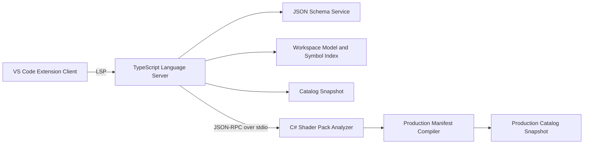

# Dawnlight Shader Pack VS Code Extension Implementation Plan

状态：Proposed  
编写日期：2026-08-15  
目标仓库：`E:\Projects\vscode\dawnlight-core`  
引擎仓库：`E:\sc\2.4 Rebuild\1.81-3\SurvivalcraftApi Dawnlight`  
当前目标格式：Manifest v3、Manifest composition source format v1、Settings UI schema v1

## 1. 文档目的

本文定义 Dawnlight 光影包 VS Code 开发工具的产品边界、总体架构、数据合同、分阶段实施步骤、测试策略和发布标准，供后续实现、评审和验收使用。

目标不是简单提供固定 JSON snippet，而是为光影包作者提供一套与生产运行时保持一致的开发环境：

1. 编辑 JSON 时获得字段、类型、枚举、说明、默认值和结构模板补全；
2. 在跨 fragment 引用 option、program、resource、pass、service、semantic、provider 等对象时获得上下文相关补全；
3. 支持定义跳转、查找引用、重命名、Hover、文件路径补全和文档符号；
4. 在 Problems 面板显示与生产 Loader 一致的组合、Catalog、资源、Hazard、活动闭包和运行时合同诊断；
5. 为后续 GLSL include、uniform/binding 校验、Program variant 解释、渲染图查看和增量重载留下稳定扩展点；
6. 支持内置最小包、标准外置包和第三方 Mod 扩展 Catalog，而不把 Dawnlight v3.1 的具体 ID 硬编码成插件规则。

## 2. 当前系统基线

### 2.1 已具备的引擎能力

当前生产系统已经具备以下基础：

- Manifest v3 单文件加载；
- `shaderpack.json` 加有序 `fragments` 的多文件组合；
- option、program、resource、pass 和 settings UI 数据驱动；
- Graphics 与 Compute Program；
- `fullscreen`、`compute`、`copy`、`clear`、`present`、`engineDraw` 和 `historyCommit` 命令；
- versioned Stage Template、Service、Semantic Provider、EngineDraw Provider 和 Capability Catalog；
- 图排序、活动闭包、资源访问、RAW/WAR/WAW Hazard 和 History 时序验证；
- 文件路径沙箱、候选 generation、事务发布和失败回滚；
- 生产 Loader 可在无 GL 条件下完成绝大多数 Manifest 验证；
- `ShaderPackCli` 已经通过 `ShaderPackManifestLoader.LoadExternal` 加载并验证外置包。

当前 Dawnlight v3.1 的规模已经超过仅靠静态 snippet 可以良好维护的范围：43 个 option、34 个 program、40 个 resource、21 个 pass、37 个 command，并分布在多个 manifest fragment 中。

### 2.2 当前工具缺口

当前仍缺少：

- 正式、版本化、可发布的 JSON Schema；
- 面向编辑器的结构化诊断协议；
- 跨文件符号索引和引用解析；
- Catalog introspection/export；
- Manifest、Settings UI、Catalog 和插件版本的兼容性协商；
- 未保存文件的 overlay 验证能力；
- Program include stack、源码映射和 variant 解释；
- 面向第三方作者的图查看、资源预算和热重载工具。

### 2.3 不能直接复用现有 CLI 的原因

现有 `tools/ShaderPackCli` 可以作为改造起点，但不能直接作为最终插件后端：

1. 当前只支持 `settings validate` 命令表面；
2. 输出主要面向人类阅读，不是稳定机器协议；
3. fatal validation 主要通过异常字符串传播；
4. CLI 直接引用完整 `Survivalcraft.csproj`；
5. 每次输入都启动一次 `dotnet` 进程会造成不可接受的编辑延迟；
6. Loader 默认从磁盘读取完整有效文件，无法分析正在编辑的残缺 JSON 和未保存内容。

因此必须采用分层验证，而不是让生产 Loader 承担所有按键级编辑工作。

## 3. 产品范围

### 3.1 第一版发布范围

第一版正式发布版本建议命名为 `Dawnlight Shader Pack Tools`，扩展 ID 暂定为：

```text
dawnlight.shader-pack-tools
```

第一版必须包含：

- Manifest root、fragment 和 Settings UI 的 JSON/JSONC 编辑支持；
- 自动发现一个工作区内的一个或多个光影包；
- 按根 Manifest 的 `fragments` 和 `settings` 属性识别文档角色；
- Schema validation、字段补全和对象模板补全；
- 包内动态 ID 补全；
- Catalog ID/version 补全；
- 文件路径补全和打开目标文件；
- 定义跳转、引用查找、Hover 和安全重命名；
- 本地快速语义诊断；
- 保存后调用生产权威分析器；
- Problems、Output Channel 和状态栏状态；
- Windows x64 的可安装 VSIX；
- Dawnlight v3.1、ToonLab、Minimal 和负例 fixture 的自动化回归。

### 3.2 后续范围

以下能力保留接口，但不阻塞第一版：

- GLSL AST 级 uniform/binding 类型校验；
- `#include` source map 和 include stack；
- shader 编译器或游戏运行时热重载连接；
- Pipeline Graph 可视化；
- Program variant explain UI；
- GPU capability 模拟；
- Resource lifetime、显存预算和 aliasing 可视化；
- Profile/preset 编辑器；
- Linux 平台 VSIX；
- 其他编辑器的独立 LSP 分发。

### 3.3 明确不做

第一阶段不实现：

- 任意 C# 类、方法或 callback 的 JSON 调用；
- 内置完整 GLSL 编译器；
- 拖拽式渲染图编辑器；
- 自动修改生产 Manifest 以“修复”复杂 Hazard；
- 隐式扫描并注册未被根 Manifest 引用的 fragment；
- 将 Dawnlight v3.1 当前固定六 MRT 合同写成永久公共格式；
- 用 TypeScript 重新实现全部生产 Loader 逻辑。

## 4. 核心架构决策

### 4.1 采用四层工具架构



各层职责如下：

| 层 | 权威范围 | 允许处理残缺文档 | 主要输出 |
|---|---|---:|---|
| JSON Schema | JSON 语法结构和局部字段合同 | 是 | 字段补全、说明、局部错误 |
| TypeScript Language Server | 工作区文档、符号、引用和上下文补全 | 是 | completion、hover、navigation、快速诊断 |
| Catalog Snapshot | 当前宿主公开 ABI | 不适用 | 动态 Catalog ID、版本、类型、限制和说明 |
| C# Analyzer | 与生产 Loader 一致的完整语义 | 默认要求可组合文档 | 权威诊断、解析图、variant 和资源计划 |

### 4.2 Schema 与 Loader 的权威边界

- JSON Schema 是公开语法合同的权威来源；
- C# production Loader/Compiler 是组合语义和运行时合法性的最终权威；
- JSON Schema 不尝试表达复杂图 Hazard、跨文件唯一性和活动闭包；
- Language Server 可以提前报告确定的跨文件错误，但诊断代码必须与 C# 权威诊断分区；
- CI 必须运行 Schema 与 Loader parity fixture，防止两套合同漂移。

建议诊断代码命名空间：

```text
DLJSONxxxx   JSON/JSONC syntax
DLSCHEMAxxxx JSON Schema
DLSYMBOLxxxx workspace symbol/reference
DLPATHxxxx   pack-relative path
DLMANxxxx    production Manifest compiler
DLCATxxxx    Catalog
DLGRAPHxxxx  graph/order/hazard
DLGLSLxxxx   optional GLSL analysis
```

### 4.3 不在插件中硬编码 Catalog

以下内容必须来自版本化 Catalog Snapshot，而不是写死在 TypeScript 代码或 JSON Schema 的 `enum` 中：

- Stage Template ID/version；
- Service ID/version；
- Semantic ID/version/value kind/required services；
- EngineDraw Provider ID/version/Program 要求；
- Capability ID/value kind；
- Texture format 和资源能力；
- command、binding、graphics state 的宿主限制；
- 最大 attachment、binding、work group 和资源尺寸限制。

这样第三方 Mod 注册 Catalog 后，可以导出自己的 Snapshot 并被插件识别，而不需要发布一个新的插件版本。

### 4.4 使用 TypeScript LSP，不使用纯 Extension Provider 集合

Language Server 使用：

- `vscode-languageserver`；
- `vscode-json-languageservice`；
- `jsonc-parser`；
- `vscode-languageclient`。

选择 LSP 的原因：

1. 多文件组合、符号和诊断状态集中管理；
2. 避免 Extension Host 中分散注册大量 provider；
3. 更容易做取消、debounce、文档版本和 stale result 控制；
4. 后续可以为其他编辑器复用语言服务器；
5. C# Analyzer 可以保持为独立 sidecar，不污染 VS Code 客户端。

### 4.5 生产分析器使用独立长驻进程

最终架构使用一个长驻 C# Analyzer 进程，通过 stdio JSON-RPC 通信。禁止在每次键入时运行一次 `dotnet run`。

开发早期可以临时使用一次性 CLI 完成协议打通，但进入正式诊断阶段前必须迁移到长驻进程。

## 5. 仓库和模块布局

### 5.1 dawnlight-core 工具仓库

建议结构：

```text
dawnlight-core/
  .github/
    workflows/
  docs/
  packages/
    contracts/
      schemas/
      src/
      test/
    language-server/
      src/
      test/
    vscode-extension/
      src/
      test/
    test-utils/
      src/
  fixtures/
    valid/
    invalid/
    completion/
    workspace/
  scripts/
  package.json
  pnpm-workspace.yaml
  tsconfig.base.json
```

模块职责：

| 模块 | 职责 |
|---|---|
| `contracts` | JSON Schema、Catalog/Analyzer protocol TypeScript 类型和版本常量 |
| `language-server` | 文档发现、Schema 服务、符号索引、补全、导航和 Analyzer 客户端 |
| `vscode-extension` | 激活、配置、命令、状态栏、Output、sidecar 生命周期和 VSIX 打包 |
| `test-utils` | fixture loader、LSP test harness、snapshot normalizer |
| `fixtures` | 正例、负例、残缺编辑、跨文件和大包场景 |

### 5.2 Survivalcraft 引擎仓库

建议新增或调整：

```text
Survivalcraft/Dawnlight/PipeLine/Shaders/Configuration/
  Compilation/
    ShaderPackCompiler.cs
    ShaderPackCompilationResult.cs
    ShaderPackCompilerDiagnostic.cs
    ShaderPackSourceMap.cs
    IShaderPackSourceProvider.cs

tools/
  ShaderPackCli/
  ShaderPackAnalyzer/
  ShaderPackContractExport/

schemas/
  shaderpack/
```

最终目标是将 GL 无关、编辑器需要的逻辑从完整游戏程序集依赖中抽离。若一次抽离风险过高，可分两步：

1. 先在现有项目内增加结构化结果和 JSON CLI；
2. 通过依赖审计逐步移动到独立 Compiler 项目。

## 6. 公共数据合同

### 6.1 Schema 文件

最低需要以下 Schema：

```text
shaderpack-common.schema.json
shaderpack-manifest-v3-root.schema.json
shaderpack-manifest-v3-single.schema.json
shaderpack-manifest-v3-fragment.schema.json
shaderpack-settings-ui-v1.schema.json
shaderpack-catalog-snapshot-v1.schema.json
shaderpack-analyzer-protocol-v1.schema.json
```

Schema 使用 JSON Schema Draft 2020-12，并满足：

- 每个 Schema 有稳定 `$id`；
- 可复用结构放在 `$defs`；
- discriminated union 使用 `oneOf`、`const` 和 `if/then`；
- 默认使用 `unevaluatedProperties: false`；
- 每个作者可见字段具有 `markdownDescription`；
- 枚举具有清晰说明；
- 合适字段提供 `default` 和 `examples`；
- 废弃字段使用 `deprecated: true`；
- 不使用远端 Schema 作为运行时唯一来源，VSIX 必须内置完整副本；
- 插件离线时仍可工作。

### 6.2 Schema 关联策略

文档角色不能只根据路径推断，因为 fragment 可以位于任意安全的包内 `.json` 路径。

关联顺序：

1. 文件名为包根直接子级 `shaderpack.json`，应用 root/single union Schema；
2. 被某个 root `fragments` 引用的文件，应用 fragment Schema；
3. 被某个 root `settings` 引用的文件，应用 Settings UI Schema；
4. 文件显式声明受支持 `$schema` 时，优先应用对应 Schema；
5. 未归属文件不强制使用 Dawnlight Schema，只提供“关联到光影包”的 Code Action。

建议引擎允许 root、fragment 和 Settings UI 文档包含可选 `$schema` 属性，并将它视为非语义作者元数据：

- 不进入 composed logical manifest；
- 不影响 canonical hash；
- 不允许改变实际 `manifestVersion` 或 `schemaVersion` 的语义。

如果暂时不修改生产格式，Language Server 仍可依靠引用图完成关联。

### 6.3 Catalog Snapshot v1

建议数据形态：

```json
{
  "contractVersion": 1,
  "host": {
    "id": "dawnlight",
    "displayName": "Dawnlight",
    "version": "3.1",
    "build": "<commit-or-build-id>"
  },
  "supportedFormats": {
    "manifest": [3],
    "sourceComposition": [1],
    "settingsUi": [1]
  },
  "stageTemplates": [],
  "services": [],
  "semantics": [],
  "engineDrawProviders": [],
  "capabilities": [],
  "resourceFormats": [],
  "limits": {}
}
```

一个 Semantic entry 至少包含：

```json
{
  "id": "dawnlight:camera/view_matrix",
  "version": 1,
  "valueKind": "matrix4",
  "requiredServices": [],
  "description": "Current camera view matrix.",
  "since": "1.0",
  "deprecated": false
}
```

Snapshot 必须满足：

- 排序确定；
- 只包含数据，不包含程序集名或可执行 callback；
- 具有 canonical hash；
- 能表达第三方 Mod 增加的条目；
- 同 ID 多版本分别列出；
- 运行时验证使用的 Snapshot 与导出 Snapshot 来自同一个注册集合；
- 文档字段缺失不影响运行时，但插件 Hover 应能降级显示 ID、版本和类型。

### 6.4 Shader Pack SDK 版本

需要增加一个独立于 `manifestVersion` 的 Shader Pack SDK/Host ABI 版本概念。

原因：

- Manifest v3 只说明 JSON 语法版本；
- Catalog 条目虽然自身带版本，但无法表达整套宿主能力基线；
- Resource format、graphics state、限制和默认行为也可能变化；
- 插件需要判断应加载哪个 bundled catalog 和说明文档。

建议未来在 root Manifest 增加：

```json
{
  "targetHost": {
    "id": "dawnlight",
    "apiVersion": "1.0"
  }
}
```

在该字段进入生产格式前，插件使用 Catalog Snapshot 中的 host version，并明确提示“未声明目标 Host ABI”。

### 6.5 Analyzer JSON-RPC 协议

建议使用 JSON-RPC 2.0 over stdio，消息由标准 `Content-Length` framing 或一行一个完整 JSON 对象传输。优先选择标准 framing，以便未来复用现有库。

最低方法：

```text
dawnlight/initialize
dawnlight/getCatalog
dawnlight/validatePack
dawnlight/dumpGraph
dawnlight/explainVariant
dawnlight/shutdown
```

`validatePack` 请求示例：

```json
{
  "jsonrpc": "2.0",
  "id": 12,
  "method": "dawnlight/validatePack",
  "params": {
    "packRoot": "E:/shaderpacks/MyPack",
    "catalogHash": "...",
    "requestVersion": 37,
    "overlays": []
  }
}
```

响应示例：

```json
{
  "jsonrpc": "2.0",
  "id": 12,
  "result": {
    "valid": false,
    "requestVersion": 37,
    "manifestHash": null,
    "diagnostics": [
      {
        "severity": "error",
        "code": "DLMAN1024",
        "file": "manifest/passes/output.json",
        "pointer": "$.passes[0].commands[2].program",
        "message": "Program 'example:missing' is not declared.",
        "related": []
      }
    ]
  }
}
```

协议要求：

- 所有 diagnostic 有稳定 code；
- `file` 是 pack-relative normalized path；
- `pointer` 使用统一 JSON path 或 JSON Pointer，不能混用；
- 推荐内部统一使用 RFC 6901 JSON Pointer，展示时可转换成 `$.passes[0]`；
- `requestVersion` 原样返回，用于丢弃 stale 结果；
- 支持 cancellation；
- Analyzer 日志走 stderr，协议只走 stdout；
- 不允许在协议中传递任意类型名或要求执行任意 C#；
- 崩溃后客户端最多自动重启有限次数，避免重启循环。

### 6.6 未保存文档 Overlay

第一版可以只在保存后运行权威 C# 验证，但协议从一开始保留 `overlays`：

```json
{
  "path": "manifest/passes/output.json",
  "version": 18,
  "content": "{ ... unsaved JSON ... }"
}
```

后续生产 Compiler 应通过 `IShaderPackSourceProvider` 读取文件：

- overlay 中存在的路径优先使用内存内容；
- 其他文件仍由受沙箱约束的磁盘 source provider 提供；
- 禁止为了验证未保存内容直接覆写用户文件；
- source freeze、canonical hash 和 path escape 规则保持不变。

## 7. Language Server 内部设计

### 7.1 核心模型

建议定义：

```text
WorkspaceRegistry
  -> ShaderPackProject[]

ShaderPackProject
  - rootUri
  - manifestDocument
  - fragmentDocuments[]
  - settingsDocument?
  - shaderRootUri
  - catalogSnapshot
  - documentGraph
  - symbolIndex
  - referenceIndex
  - diagnosticGeneration
```

文档角色：

```text
ManifestRoot
ManifestSingleFile
ManifestFragment
SettingsUi
ShaderSource
Asset
Unknown
```

符号种类：

```text
Option
Program
Resource
Pass
Page
Group
Control
TranslationKey
StageTemplate
Service
Semantic
EngineDrawProvider
Capability
ShaderFile
AssetFile
```

每个符号至少保存：

- canonical ID；
- kind；
- definition URI；
- definition range；
- selection range；
- fragment order 和 local array order；
- parsed summary；
- 是否来自 pack、BuiltIn 或 external Catalog；
- version/value kind/resource kind/program kind 等过滤元数据。

### 7.2 工作区发现

发现规则：

1. 打开文件时向上查找最近的 `shaderpack.json`；
2. 工作区启动时扫描 `**/shaderpack.json`；
3. 默认排除 `.git`、`node_modules`、`bin`、`obj` 和用户配置的 exclude；
4. 读取 root 后只跟踪显式 `fragments`、`settings`、`shaderRoot` 和被引用 asset；
5. 支持一个 VS Code workspace 内多个 pack；
6. 同一个文档只能属于一个最近的 pack root，检测到歧义时报告诊断；
7. 不将构建输出目录和源码包错误地合并成一个项目。

需要监听：

- root Manifest 创建、删除、重命名和修改；
- fragment/settings/shader/asset 的创建、删除、重命名和修改；
- VS Code 文档 open/change/save/close；
- workspace folder 变化；
- SDK/Catalog Snapshot 变化。

### 7.3 容错解析

按键级分析不能要求完整 JSON。

实现要求：

- 使用 `jsonc-parser` 解析 AST 和精确 range；
- 允许生产 Loader 已支持的注释和尾随逗号；
- 语法错误时尽量保留此前有效的 pack index；
- 新 AST 中能确定的局部定义覆盖旧索引；
- 不因一个 fragment 的临时语法错误清空整个包所有补全；
- 完整重组成功后再原子替换 composed index；
- 文档版本变更后取消未完成分析；
- 所有异步结果提交前检查文档和 project generation。

### 7.4 Composition 模型

Language Server 必须复现作者层组合顺序，但不复制全部生产语义：

1. root metadata 只来自 `shaderpack.json`；
2. composition 开启后，定义数组只来自有序 fragment；
3. fragment 不能递归 include；
4. 按 `fragments` 顺序和每个数组的局部顺序建立定义序列；
5. 引用允许跨文件并指向后续 fragment；
6. 重复 normalized path、self inclusion、缺失文件和非法路径产生快速诊断；
7. ID uniqueness 由本地索引快速检查，最终结果由 C# Analyzer 确认；
8. canonical hash 不由 Language Server 自行声明为权威。

### 7.5 Schema completion 与动态 completion 合并

`vscode-json-languageservice` 提供：

- property completion；
- enum/value completion；
- hover description；
- Schema diagnostics；
- object/array skeleton。

Language Server 再根据 AST path 添加动态 completion。合并时按以下 key 去重：

```text
label + kind + insertion range + insertText
```

排序建议：

1. 当前包内类型匹配的符号；
2. 当前 Catalog 精确版本条目；
3. BuiltIn fallback；
4. Schema 静态枚举；
5. 通用 snippet。

### 7.6 动态补全矩阵

| JSON 位置 | 候选来源 | 过滤规则 |
|---|---|---|
| `fragments[]` | pack 内 `.json` 文件 | 不包含 root、自身、重复项和越界路径 |
| `settings` | pack 内 `.json` 文件 | 排除已用作 fragment 的文件 |
| Program `vertex/fragment/compute` | `shaderRoot` 文件 | 按 graphics/compute 和扩展名过滤 |
| define `option` | option index | 所有 option，可显示类型和 impact |
| define `map` key | 所选 option | 使用 boolean/allowed/range 可枚举值 |
| pass `programs[]` | program index | 所有 Program，去除当前数组重复项 |
| command `program` | containing pass programs | fullscreen/present 仅 graphics，compute 仅 compute |
| binding `resource` | resource index | 按 sampler/image/storage kind 和 access 过滤 |
| target `resource` | resource index | 只提示可作为对应 color/depth attachment 的资源 |
| copy source/destination | resource index | 排除自身并按 kind/format/aspect 过滤 |
| history commit resource | resource index | 只提示 history lifetime |
| ordering before/after/requires | pass index | 排除当前 pass 和数组重复项 |
| condition option | option index | 排除会形成明显自引用的候选 |
| condition equals/notEquals/in | selected option | 按 option 类型和 `allowed` 提供值 |
| service ID/version | Catalog Snapshot | exact ID/version 联动 |
| semantic ID/version | Catalog Snapshot | 显示 value kind 和 required services |
| provider ID/version | Catalog Snapshot | 按 command、program presence 和 provider contract 过滤 |
| stage template/version | Catalog Snapshot | 按 target/phase/host 要求过滤 |
| capability ID | Catalog Snapshot | 按 capability value kind 提供值 |
| UI control option | option index | 排除已覆盖 option，或标注重复引用 |
| UI widget | selected option | boolean -> toggle，number/integer -> slider，allowed -> choice |
| UI choice value | selected option | 使用 option allowed values |
| translation key | Settings translations | 按 label/description/value 使用位置过滤 |

无法完全确定时允许显示候选，但必须在 detail 中说明限制，不能静默过滤合法第三方扩展。

### 7.7 Hover

Hover 至少显示：

- ID 和 symbol kind；
- definition 所在 fragment；
- option 类型、默认值、allowed/range 和 impact；
- resource kind、format、size、lifetime、content；
- program kind、shader 文件、compile mode 和 define 数量；
- pass stage、target、phase、command 数量；
- Catalog entry 的 version、value kind、required services、since/deprecated 和说明；
- path 的 normalized pack-relative 路径和存在状态。

Hover 不执行完整 Analyzer，也不阻塞等待 sidecar。

### 7.8 Definition、References 和 Rename

必须支持：

- option/program/resource/pass ID 的定义跳转；
- fragment/settings/shader/asset 路径跳转；
- Catalog ID 跳转到虚拟只读 Catalog 文档；
- Find References 跨所有 fragment 和 Settings UI；
- Rename 更新定义和所有已确认引用；
- 重命名 shader/asset 文件时提示是否更新 JSON 路径，不默认执行文件移动；
- 存在重复定义、语法错误或不确定引用时拒绝 Rename，并给出原因；
- Rename 结果使用 `WorkspaceEdit`，由 VS Code 统一预览和应用。

### 7.9 快速诊断

Language Server 可以即时报告：

- JSON/JSONC syntax；
- Schema type/required/unknown property；
- fragment/settings/shader/asset 路径不存在；
- 路径越界、rooted path、`.`/`..`、重复 normalized path；
- 明确重复 ID；
- 明确未知 pack-local ID；
- Program kind 与 command type 不匹配；
- historyCommit 指向非 history resource；
- UI widget 与 option 类型不匹配；
- UI option 重复、遗漏或 unknown；
- Catalog ID/version unknown；
- translation key 缺失；
- 明确的 ordering self-reference。

复杂 Hazard、活动闭包、Provider host 和完整运行时合同由 C# Analyzer 报告。

### 7.10 诊断调度

建议四级调度：

| 级别 | 触发 | debounce | 数据源 |
|---|---|---:|---|
| L0 syntax | 每次编辑 | 0-50 ms | jsonc-parser |
| L1 schema | 每次编辑 | 100-150 ms | JSON language service |
| L2 symbol | 相关文档编辑 | 150-250 ms | workspace index |
| L3 authoritative | 保存、显式命令，后续支持稳定输入 | 0/750-1000 ms | C# Analyzer |

诊断发布规则：

- 每个 source 标记独立 owner，不互相清空；
- 新 generation 发布时原子替换同 owner 旧结果；
- stale Analyzer 结果直接丢弃；
- sidecar 不可用时保留 L0-L2，并显示一次非阻塞状态；
- Analyzer 恢复后自动重新验证受影响 pack。

## 8. VS Code Extension Client 设计

### 8.1 激活条件

建议：

```json
{
  "activationEvents": [
    "workspaceContains:**/shaderpack.json",
    "onCommand:dawnlight.validateShaderPack"
  ]
}
```

不要在所有 JSON 文件打开时无条件激活。

### 8.2 配置项

建议提供：

```text
dawnlight.shaderPack.validation.enabled
dawnlight.shaderPack.validation.authoritativeMode
dawnlight.shaderPack.sdkPath
dawnlight.shaderPack.catalogPath
dawnlight.shaderPack.analyzerPath
dawnlight.shaderPack.trace.server
dawnlight.shaderPack.workspace.exclude
dawnlight.shaderPack.glsl.validatorPath
```

推荐默认值：

| 配置 | 默认值 |
|---|---|
| validation.enabled | `true` |
| authoritativeMode | `onSave` |
| sdkPath | `auto` |
| catalogPath | 空，自动选择 |
| analyzerPath | 空，使用 VSIX bundled sidecar |
| trace.server | `off` |
| workspace.exclude | `.git,node_modules,bin,obj` |

配置错误必须落到 Output Channel，并在相关命令执行时显示明确错误；不要重复弹窗。

### 8.3 命令

第一版：

```text
Dawnlight: Validate Shader Pack
Dawnlight: Restart Language Server
Dawnlight: Restart Analyzer
Dawnlight: Select Shader Pack SDK
Dawnlight: Open Catalog Entry
Dawnlight: Show Output
```

后续：

```text
Dawnlight: Show Pipeline Graph
Dawnlight: Explain Program Variant
Dawnlight: Show Resource Plan
Dawnlight: Reload Active Shader Pack
```

### 8.4 状态显示

状态栏仅在活动编辑器属于 Dawnlight pack 时显示：

```text
Dawnlight: Ready
Dawnlight: Indexing
Dawnlight: Validating
Dawnlight: 3 Errors
Dawnlight: Analyzer Offline
Dawnlight: SDK Mismatch
```

点击状态栏打开当前 pack 的简短状态 Quick Pick 或 Output，不创建常驻复杂侧栏。

### 8.5 输出通道

建立独立 `Dawnlight Shader Pack` Output Channel，包含：

- 当前 extension、language server、protocol 和 SDK version；
- 发现的 pack roots；
- Schema/Catalog 来源和 hash；
- Analyzer 启动、停止、重启和 stderr；
- 每次权威验证的 request ID、耗时和结果摘要；
- trace 开启时的 LSP/Analyzer 细节。

日志不能输出完整 shader/manifest 内容，也不能泄露无关环境变量。

## 9. C# Compiler 和 Analyzer 改造

### 9.1 结构化诊断

新增不可变诊断模型：

```csharp
public sealed record ShaderPackCompilerDiagnostic(
    ShaderPackDiagnosticSeverity Severity,
    string Code,
    string RelativePath,
    string JsonPointer,
    string Message,
    IReadOnlyList<ShaderPackRelatedLocation> RelatedLocations);
```

Loader 当前公开 throw API 可以保留以兼容运行时，但内部流程应逐步改为：

```text
TryCompile/CompileResult
  -> Descriptor?
  -> Diagnostics
  -> SourceMap
```

运行时 `LoadExternal` 在 `CompileResult` 有 error 时统一构造原有异常；Analyzer 直接消费结构化结果。禁止 Analyzer 解析异常 message 获取路径。

### 9.2 Source Map

Composition 后逻辑数组会丢失物理 fragment 边界，因此 Compiler 必须保存：

```text
logical definition/field
  -> source relative path
  -> JSON Pointer
  -> byte/UTF-16 range if available
```

最低要求是 relative path 加 pointer；精确 VS Code range 可以由 Language Server 使用原始文档 AST 二次映射。

Source Map 还将用于后续：

- shader include stack；
- canonical hash explain；
- graph node 跳转；
- related diagnostics；
- variant define 来源解释。

### 9.3 Compiler 依赖拆分

依赖方向建议：

```text
Dawnlight.ShaderPack.Contracts
    <- Dawnlight.ShaderPack.Compiler
        <- Survivalcraft runtime
        <- ShaderPackAnalyzer
        <- ShaderPackCli
```

Compiler 不应引用：

- OpenGL 对象；
- Window/ViewWidget；
- 游戏世界实例；
- 运行时 generation publication；
- 菜单和 UI 控件。

Compiler 可以依赖纯数据 Catalog registration metadata。需要运行时 callback 的 Catalog entry 必须投影为只读 authoring metadata 后再传入 Compiler。

### 9.4 Catalog Export

从 `PipelineCatalogSnapshot` 导出，而不是维护第二份 ID 清单。

需要补齐作者工具需要但当前 Catalog 可能没有的 metadata：

- description；
- parameter/contract summary；
- availability；
- since/deprecated；
- example；
- documentation URL 或本地文档 key。

运行时关键路径不需要读取这些说明字段；可以通过并行的 authoring metadata registry 关联同一个 exact key，但必须有测试保证没有 orphan 和 duplicate。

### 9.5 Analyzer 进程生命周期

Analyzer：

- 一次 extension session 只启动一个；
- 首次需要 L3 validation 或 Catalog 时懒启动；
- 使用随机 request ID；
- 支持 cancellation；
- 捕获非 fatal exception 并返回 internal diagnostic；
- stdout 仅传协议；
- stderr 传日志；
- shutdown 超时后由 extension 终止子进程；
- extension deactivate 时清理；
- 崩溃自动重启最多 3 次，随后进入 Offline，等待用户手动重启。

### 9.6 发布形式

开发阶段：

```text
dotnet run --project tools/ShaderPackAnalyzer
```

发布阶段优先使用 platform-specific self-contained single-file：

```text
win-x64
linux-x64（后续）
```

VSIX 根据平台只包含对应 sidecar，避免要求光影包作者安装 .NET SDK。若单文件发布与依赖不兼容，可保留 self-contained directory，不强制追求单文件。

## 10. GLSL 集成计划

### 10.1 第一版边界

第一版不实现自己的 GLSL tokenizer/parser/compiler，只负责：

- 将 Manifest shader path 变成可点击链接；
- 路径存在性和扩展名检查；
- `shaderRoot` 内 `#include` 基础路径跳转；
- 将 `.vsh`、`.psh`、`.fsh`、`.comp`、`.csh` 与用户已有 GLSL 扩展协同；
- 在 README 推荐兼容的 GLSL 语法扩展，但不强制安装。

### 10.2 第二阶段能力

后续选择成熟 GLSL parser 或 tree-sitter grammar，建立：

- uniform declaration index；
- sampler/image/SSBO symbol 和类型；
- `#include` DAG；
- duplicate/cyclic include；
- Manifest binding symbol 与 GLSL uniform 对应；
- semantic value kind 与 uniform type 对应；
- fragment output location 与 drawbuffer/target layout 对应；
- compute local size 与 dispatch 提示；
- define variant 的条件来源。

所有编译成功与否仍以实际 Dawnlight shader compiler 或明确配置的外部 validator 为准。

### 10.3 Variant 解释

`Explain Program Variant` 至少输出：

- Program ID；
- Program kind 和 source files；
- 当前 option/capability 输入；
- 每个 define 的最终值；
- define 来源位置；
- compile mode；
- variant fingerprint；
- include/source list；
- active/inactive 原因。

先以 Output/虚拟文本文档展示，确认数据稳定后再考虑 Webview。

## 11. Pipeline Graph 和资源查看

图查看属于后续功能，但 Analyzer 协议应从开始保留 `dumpGraph`。

图模型至少包含：

- active/inactive pass；
- stage target、phase 和 ordering edge；
- command 顺序；
- Program invocation；
- resource read/write/history commit event；
- Service dependency；
- conditional activation source；
- warning/error location。

首版图输出使用稳定 JSON 和 DOT；VS Code UI 后续可以用 Webview 渲染。不要让 Webview 直接重新解析 Manifest。

## 12. 版本与兼容策略

### 12.1 独立版本

至少存在以下独立版本：

```text
VS Code extension version
LSP protocol version
Analyzer protocol version
JSON Schema version
Manifest version
Source composition version
Settings UI schema version
Shader Pack SDK/Host ABI version
Catalog Snapshot contract version
```

这些版本不能合并成一个数字。

### 12.2 初始化协商

Extension 启动时完成：

1. VS Code client 与 TS server 协商 server protocol；
2. TS server 与 Analyzer 协商 analyzer protocol；
3. Analyzer 返回支持的 Manifest/UI/Catalog contract versions；
4. 当前 pack 声明或推断目标 Host ABI；
5. 选择最匹配的 Schema 和 Catalog；
6. 无精确匹配时显示 warning，而不是用错误版本静默校验。

### 12.3 降级行为

| 故障 | 降级行为 |
|---|---|
| Analyzer 不存在或崩溃 | 保留 Schema、索引、补全和 L0-L2 诊断 |
| Catalog 不存在 | 使用 bundled official catalog，并标记来源 |
| SDK 版本不匹配 | 保留结构补全，Catalog completion 标记可能不准确 |
| 单个 fragment 语法错误 | 保留其他 fragment 的稳定索引 |
| root 不可解析 | 当前文件继续 Schema 编辑，暂停包级组合 |
| shader compiler 不可用 | 保留路径和声明级分析，不报告编译结论 |

## 13. 安全和可靠性要求

### 13.1 文件系统

- 所有 pack path 使用规范化 pack-relative path；
- 拒绝 rooted、drive-qualified、`.`、`..` 和空 segment；
- 验证 symlink/reparse point 最终路径没有逃出 pack root；
- 不跟随 workspace 外部路径做递归扫描；
- 插件不自动写入 Manifest 或 shader；
- Rename 和 Code Action 必须通过 `WorkspaceEdit` 让用户确认；
- 临时文件位于明确的 extension storage，不写入 pack root；
- Analyzer 必须复用生产路径沙箱规则。

### 13.2 进程和协议

- sidecar 参数使用进程 API 参数数组，不拼接 shell command；
- 不把 Manifest 字段解释为命令、类型名或程序集路径；
- 限制单条协议消息和 overlay 总大小；
- 支持超时和取消；
- 无效 JSON-RPC 响应使当前请求失败，不能使 Extension Host 崩溃；
- Catalog Snapshot 只作为数据，不加载其中声明的程序集；
- 外部 analyzerPath 和 catalogPath 在状态/日志中明确显示来源。

### 13.3 并发与 stale state

- 每个 pack 有单调递增 project generation；
- 每个文档有 LSP version；
- 每次 Analyzer request 有 requestVersion；
- result 必须同时匹配 project generation 和 requestVersion 才能发布；
- 保存 A、保存 B、A 后返回的顺序不能让 A 覆盖 B；
- workspace folder 删除后，晚到结果必须丢弃；
- Extension deactivate 后禁止继续发布 diagnostics。

## 14. 性能目标

以当前 Dawnlight v3.1 规模作为第一条基准：

| 项目 | 目标 |
|---|---:|
| warm completion p95 | 50 ms 内 |
| 单文档 syntax/schema diagnostics | 250 ms 内 |
| 修改一个 fragment 后增量索引 | 300 ms 内 |
| 初次索引 Dawnlight v3.1 | 1 s 内，不含 Analyzer 冷启动 |
| 保存后权威验证 warm response | 2 s 内 |
| 无编辑时 CPU | 接近 0，不轮询全工作区 |
| Analyzer process count | 每个 VS Code window 最多 1 个 |

性能实现原则：

- 只解析变更文档；
- 索引使用 immutable snapshot 加原子替换；
- completion 不等待 C# Analyzer；
- Catalog 按 hash 缓存；
- 文件 watcher 只覆盖已发现 pack 和必要 glob；
- 不在每次编辑时计算权威 canonical hash；
- 不在每次 Hover 时读取磁盘；
- 大型文本日志只在 trace 模式输出。

## 15. 测试策略

### 15.1 Schema 测试

使用 Ajv 2020：

- 每种 discriminated union 至少一个正例和一个负例；
- unknown property；
- required property；
- enum/type/range；
- single-file 与 composed root 互斥规则；
- fragment 禁止 metadata/include；
- Settings UI widget/condition 基础结构；
- comments/trailing commas 由 JSONC parse 层单独验证；
- Schema 自身通过 meta-schema validation。

### 15.2 Language Server 单元测试

使用带光标标记的 fixture：

```jsonc
{
  "type": "compute",
  "program": "|"
}
```

验证：

- completion label、kind、detail、sortText 和 insertText；
- 类型过滤；
- 定义跳转 URI/range；
- references 数量；
- rename WorkspaceEdit；
- Hover 内容；
- path normalization；
- 多 pack 隔离；
- stale result 丢弃；
- fragment 临时损坏时的索引保留。

### 15.3 Analyzer 合同测试

- initialize/version negotiation；
- catalog hash；
- valid pack；
- invalid path；
- unknown Catalog/version；
- duplicate ID；
- graph Hazard；
- History 时序；
- cancellation；
- crash/EOF；
- stderr 不污染 stdout；
- overlay 优先级；
- source map 文件和 pointer。

### 15.4 Parity 测试

同一组 fixture 同时经过：

```text
JSON Schema
TypeScript fast analyzer
C# production Compiler
```

Parity 不要求三层产生完全相同的错误数量，但要求：

- 所有生产有效 fixture 都通过 Schema；
- Schema 拒绝的结构错误不会被生产 Loader 接受；
- TypeScript 不将生产合法动态 Catalog 条目标成硬错误；
- C# diagnostic code/path/pointer snapshot 稳定；
- 当前 Dawnlight v3.1 和 ToonLab 无新增 error。

### 15.5 VS Code 集成测试

使用 `@vscode/test-electron`：

- 扩展按 workspaceContains 激活；
- Language Client 启动；
- 打开 fragment 获得 Schema 和动态 completion；
- Problems 收到 diagnostics；
- Validate 命令工作；
- Analyzer Offline 降级；
- workspace restart 后恢复索引；
- deactivate 清理进程。

### 15.6 真实包验收矩阵

| 包 | 目的 |
|---|---|
| BuiltIn/Minimal fixture | 零扩展资源、零或最小 option、空 UI |
| Dawnlight v3.1 | 完整纵向功能和多 fragment 压力 |
| ToonLab | 不同 feature 组合和第三方开发视角 |
| FullscreenClosure fixtures | 条件活动闭包 |
| P8/P9 negative fixtures | 错误诊断和 source location |
| 独立 clean-room pack | 防止只适配 Dawnlight ID/目录布局 |

## 16. CI 和发布

### 16.1 工具仓库 CI

每次提交：

```powershell
pnpm install --frozen-lockfile
pnpm lint
pnpm typecheck
pnpm test
pnpm test:schema
pnpm test:lsp
pnpm build
```

发布候选增加：

```powershell
pnpm test:vscode
pnpm package:vsix
```

### 16.2 引擎仓库 CI

保持现有命令：

```powershell
dotnet build .\Survivalcraft.Windows\Survivalcraft.Windows.csproj -c Debug
dotnet test .\Survivalcraft.Pipeline.Tests\Survivalcraft.Pipeline.Tests.csproj -c Debug --no-restore
```

增加：

```powershell
dotnet test .\Dawnlight.ShaderPack.Compiler.Tests\Dawnlight.ShaderPack.Compiler.Tests.csproj -c Debug
dotnet run --project .\tools\ShaderPackCli\ShaderPackCli.csproj -- manifest validate <pack> --format json
dotnet run --project .\tools\ShaderPackCli\ShaderPackCli.csproj -- catalog export --format json
```

### 16.3 合同同步

工具仓库不能手工复制未知来源的 Schema/Catalog。

建议发布流程：

1. 引擎仓库生成 Schema bundle、official Catalog Snapshot 和 protocol manifest；
2. 生成文件带 canonical hash 和 source commit；
3. dawnlight-core CI 下载或通过明确脚本同步；
4. CI 检查 working tree 无未提交生成差异；
5. VSIX 内置 bundle；
6. Release notes 记录支持的 Host ABI 范围。

开发期也可以使用固定相对/配置路径读取本地引擎输出，但发布不得依赖开发机器绝对路径。

### 16.4 VSIX 发布

第一版只发布 `win32-x64` platform-specific VSIX，并包含：

- bundled TS server；
- bundled JSON Schema；
- official Catalog fallback；
- win-x64 Analyzer sidecar；
- license、README、CHANGELOG；
- 最小示例链接或内置 snippets。

后续根据需求增加 `linux-x64`。通用 VSIX 不应同时携带所有大型 self-contained runtime，除非体积评估允许。

## 17. 分阶段实施步骤

下面的阶段编号使用 `VSE`，避免与引擎 P8/P9/P0 规划混淆。

### VSE-0：冻结工具合同和开发基线

目标：在编写实现前冻结跨仓边界和版本策略。

任务：

1. 确认扩展名称、publisher、extension ID 和许可证；
2. 确认 Manifest v3、source format v1、Settings UI v1 为第一版支持范围；
3. 记录当前生产 Loader、Catalog 和 CLI 入口；
4. 确认 JSONC 行为：允许注释和尾随逗号；
5. 决定是否允许非语义 `$schema`；
6. 定义 Schema、Catalog Snapshot 和 Analyzer protocol 的独立版本；
7. 决定第一版 Analyzer 仅 on-save，overlay 延后；
8. 建立跨仓 fixture 同步策略；
9. 将本文评审结论转为 ADR。

输出：

- `docs/adr/0001-tooling-architecture.md`；
- `docs/adr/0002-contract-versioning.md`；
- 支持版本矩阵；
- 初始 fixture 清单。

验收：

- 没有未决问题会改变进程边界或公共协议；
- 引擎与插件维护者认可 Schema/Loader 权威边界；
- 明确第一版 Windows-only 或跨平台范围。

### VSE-1：建立 C# 结构化验证和 Catalog 导出

目标：让编辑器可以可靠消费生产验证，不解析文本。

引擎仓库任务：

1. 新增 `ShaderPackCompilerDiagnostic`、severity、code 和 related location；
2. 为 composed source 建立 relative path + JSON pointer source map；
3. 给现有 Loader 增加返回结构化结果的内部入口；
4. 保持原有 throw API 和游戏行为兼容；
5. 增加 `manifest validate --format text|json`；
6. 保留 `settings validate` 兼容命令，内部转发新实现；
7. 增加 `catalog export --format json`；
8. 导出 Catalog Snapshot canonical hash；
9. 为正例、Schema 错误、跨 fragment 引用、Catalog 错误和 Hazard 添加测试；
10. 确认所有错误都有 stable code 和 source location。

验收：

- Dawnlight v3.1 JSON validation 返回 `valid=true`；
- 任一测试错误可定位到具体 fragment 和 JSON pointer；
- stdout JSON 可被严格 parser 读取，日志只出现在 stderr；
- Catalog export 连续两次输出字节稳定；
- 原 Windows Debug build 和 Pipeline tests 通过。

### VSE-2：发布 JSON Schema v1

目标：不依赖 Language Server 高级逻辑即可获得基础编辑体验。

任务：

1. 建立 `contracts` package；
2. 编写 common definitions；
3. 编写 composed root 与 single-file root union；
4. 编写 fragment Schema；
5. 为 option 类型、predicate 和 invalidation impact 建模；
6. 为 Graphics/Compute Program 和 define 建模；
7. 为 texture2D/textureCube/buffer、size、sampling、content 和 history 建模；
8. 为 stage、service、program invocation、binding、semantic、target 和 viewport 建模；
9. 为七种 command 建立 discriminated union；
10. 为 Settings UI page/group/control/widget/translation 建模；
11. 加入完整 markdown descriptions；
12. 建立 Ajv 正负 fixture；
13. 使用现有 Dawnlight/ToonLab Manifest 运行 Schema 验证；
14. 建立 Schema 与 Loader parity report。

验收：

- 当前全部有效包通过 Schema；
- 每个公开 command/resource/program/widget 变体有正负测试；
- unknown property 和错误 discriminant 可以精确报错；
- Schema bundle 完全离线可用；
- Schema `$id` 和 contract version 已冻结。

### VSE-3：搭建 VS Code Extension 和 LSP 骨架

目标：建立可运行、可调试、可打包的最小工具链。

任务：

1. 初始化 pnpm workspace；
2. 配置 TypeScript strict、ESLint、formatter 和 project references；
3. 建立 `vscode-extension` client；
4. 建立 `language-server`；
5. client 通过 stdio 启动 server；
6. 注册 document selector、workspace folder 和配置同步；
7. 接入 JSON language service 和 bundled Schema；
8. 增加 Output Channel、Restart Server 和 Show Output 命令；
9. 增加 `@vscode/test-electron` smoke test；
10. 使用 esbuild 分别 bundle client/server；
11. 生成首个开发 VSIX。

验收：

- 打开 `shaderpack.json` 后扩展激活；
- 字段 completion、hover 和 Schema diagnostics 工作；
- 普通非 Dawnlight JSON 不激活或不被错误关联；
- server crash 后可手动重启；
- VSIX 可安装并离线工作。

### VSE-4：实现 Pack Discovery、Composition 和符号索引

目标：建立跨 fragment 智能功能的稳定基础。

任务：

1. 实现 `WorkspaceRegistry` 和 `ShaderPackProject`；
2. 实现 root 发现和多 pack 隔离；
3. 解析 `fragments`、`settings` 和 `shaderRoot`；
4. 动态关联 root/fragment/settings Schema；
5. 实现 JSONC tolerant AST cache；
6. 建立 definition index；
7. 建立 reference index；
8. 实现 fragment order 和 forward reference；
9. 实现文件 watcher 和增量 invalidation；
10. 实现路径 normalize/sandbox 快速检查；
11. 实现 project/document generation 和 stale result 防护；
12. 添加多 pack、残缺 fragment、重命名和删除 fixture。

验收：

- Dawnlight v3.1 全部显式 fragment 被正确归属；
- 任一 option/program/resource/pass definition 可以被索引；
- forward references 正确；
- 修改一个 fragment 不重新扫描无关 workspace；
- 一个损坏 fragment 不清空其他稳定符号；
- 多 pack 中相同 ID 不互相污染。

### VSE-5：实现补全、Hover、导航和重命名

目标：达到第一版核心作者体验。

任务：

1. 实现动态 completion context resolver；
2. 实现 completion matrix 中的候选和类型过滤；
3. 合并、去重和排序 Schema/dynamic completion；
4. 实现路径 completion；
5. 实现 Hover；
6. 实现 Go to Definition；
7. 实现 Find References；
8. 实现安全 Rename；
9. 实现 Document Symbols 和 Workspace Symbols；
10. 实现 Catalog 虚拟文档；
11. 添加所有 context 的 caret fixture；
12. 记录 completion 性能基线。

验收：

- compute command 不提示 graphics-only Program；
- historyCommit 只优先提示 history resource；
- semantic completion 显示 version/value kind；
- UI widget 根据 option 类型过滤；
- definition/reference/rename 跨 fragment 正确；
- warm completion p95 满足性能目标。

### VSE-6：集成 C# Analyzer 权威诊断

目标：让编辑器诊断与生产运行时保持一致。

任务：

1. 建立 `ShaderPackAnalyzer` 长驻进程；
2. 实现 initialize/getCatalog/validatePack/shutdown；
3. Extension 实现 sidecar 查找、启动、监控和退出；
4. TS server 实现 Analyzer JSON-RPC client；
5. 实现 request cancellation 和 version check；
6. 将 diagnostic pointer 映射为 VS Code range；
7. 实现保存触发和 Validate 命令；
8. 实现 Analyzer Offline 降级；
9. 实现有限崩溃重启；
10. 打包 win-x64 self-contained sidecar；
11. 建立真实包、负例、crash、timeout 和 stale response 测试；
12. 测量 Analyzer 冷启动和 warm validation。

验收：

- Problems 面板显示生产 diagnostic code、文件和精确字段；
- 保存后的有效 Dawnlight v3.1 无 error；
- Hazard/closure/Catalog 错误能显示；
- Analyzer 崩溃不影响 completion 和 Schema diagnostics；
- 旧 validation result 不能覆盖新保存结果；
- 用户无需安装 .NET SDK。

完成 VSE-6 后可以发布 v0.1。

### VSE-7：完善 Settings UI 和 GLSL 基础联动

目标：补齐 P9 作者体验并建立 shader 文件导航。

任务：

1. Settings UI option coverage 诊断；
2. widget/option type 联动；
3. allowed value 和 condition value completion；
4. translation key completion、definition 和 missing-key 诊断；
5. shader path definition/document link；
6. asset path 预览入口；
7. `#include` 基础扫描和跳转；
8. 可选外部 GLSL validator 配置；
9. 建立 include cycle 和 missing include 快速诊断；
10. 添加 P9 authored/auto/empty fixture。

验收：

- 43 个当前 Dawnlight option 的 UI coverage 与生产结果一致；
- choice/slider/toggle 不提示不兼容 option；
- translation 和 shader/include 跳转工作；
- 未配置 GLSL validator 时不产生误导性编译错误。

### VSE-8：Analyzer Overlay、Variant 和 Graph

目标：实现未保存权威验证和高级诊断工具。

任务：

1. 抽象 `IShaderPackSourceProvider`；
2. Analyzer 接收 unsaved overlays；
3. 保证 overlay source freeze/hash/path sandbox；
4. 增加 `explainVariant`；
5. 增加 `dumpGraph`；
6. 先提供 JSON/DOT/虚拟文本文档；
7. 将 graph node 和 diagnostic 关联源位置；
8. 增加资源访问和 Service dependency edge；
9. 评估 Webview graph；
10. 为大型图建立性能和布局测试。

验收：

- 未保存合法编辑可获得权威诊断；
- 不写入或替换用户文件；
- variant 每个 define 有来源；
- graph 与生产 resolved plan 关键计数一致；
- 点击节点可以回到 JSON definition。

### VSE-9：发布加固和第三方验收

目标：从内部工具升级为第三方可用产品。

任务：

1. 创建 clean-room 示例包；
2. 邀请未参与引擎实现的作者按公开文档完成修改；
3. 修正文档和 completion 中的 Dawnlight 专用假设；
4. 完成安装、配置、故障排查和兼容矩阵文档；
5. 建立 extension telemetry policy，默认不收集；
6. 检查 bundled binary license；
7. 生成 CHANGELOG 和 release notes；
8. 签名或校验 Analyzer binary；
9. 执行 VSIX 干净环境安装测试；
10. 发布正式 v1.0。

验收：

- clean-room 作者无需阅读 C# 即可完成基本包修改；
- 插件不要求 Dawnlight v3.1 固定目录或固定 ID；
- 文档、Schema、Catalog 和 Analyzer 版本匹配；
- 当前支持包完整回归通过；
- 无 P0/P1 安全、数据损坏或错误自动修改问题。

## 18. 推荐提交序列

为了便于审查，避免一次提交同时修改协议、Schema、LSP 和运行时，建议按以下提交拆分：

1. `Document shader pack tooling architecture`；
2. `Introduce structured shader pack diagnostics`；
3. `Preserve composed manifest source locations`；
4. `Add manifest validate JSON output`；
5. `Export pipeline catalog snapshot`；
6. `Publish Manifest v3 JSON schemas`；
7. `Scaffold Dawnlight VS Code language client and server`；
8. `Associate composed shader pack documents with schemas`；
9. `Index shader pack definitions and references`；
10. `Complete pack-local identifiers contextually`；
11. `Complete host catalog contracts from snapshots`；
12. `Add navigation hover references and rename`；
13. `Add long-running shader pack analyzer protocol`；
14. `Publish authoritative diagnostics to VS Code`；
15. `Package the Windows analyzer with the VSIX`；
16. `Add settings UI and shader path authoring support`；
17. `Record v0.1 acceptance evidence`。

每个提交都应同时包含对应测试，禁止最后一次性补测试。

## 19. 风险和缓解措施

| 风险 | 影响 | 缓解措施 |
|---|---|---|
| JSON Schema 与 Loader 漂移 | 插件接受运行时拒绝的包，或反之 | parity fixtures、生成 hash、跨仓 CI |
| TypeScript 重复实现过多生产逻辑 | 长期维护困难 | TS 只做快速确定性检查，C# 保持最终权威 |
| fatal error 没有结构化位置 | Problems 只能指向文件顶部 | typed diagnostics + composition source map |
| Catalog 硬编码 | Mod 扩展和新引擎版本立即失效 | versioned Catalog Snapshot export |
| 每次验证启动 dotnet | 高延迟和进程抖动 | 长驻 self-contained Analyzer |
| 未保存文件与磁盘状态不同 | 权威诊断过期 | v0.1 on-save，后续 overlay source provider |
| fragment 临时语法错误清空索引 | 输入时补全闪烁 | tolerant AST + last-known-good immutable snapshot |
| 多 pack/构建输出重复发现 | 符号串包和重复诊断 | nearest root ownership、exclude、项目隔离 |
| 第三方 Catalog 缺少说明 | Hover 质量低 | authoring metadata registry，允许优雅降级 |
| VSIX 包含 .NET runtime 体积大 | 下载和发布成本 | platform-specific VSIX，评估 single-file/trimming |
| GLSL 方言与通用 validator 不一致 | 误报 | 编译诊断标记来源，生产 compiler 最终权威 |
| Graph Webview 过早开发 | 消耗时间但核心体验不稳定 | v0.1 先完成 completion/navigation/diagnostics |

## 20. 第一版完成定义

v0.1 只有同时满足以下条件才算完成：

1. 当前 Dawnlight v3.1、ToonLab 和 Minimal fixture 无错误误报；
2. Manifest root、任意位置 fragment 和 Settings UI 都能正确关联 Schema；
3. option、program、resource、pass 和 Catalog 引用支持上下文补全；
4. 所有 pack-local ID 支持定义跳转和查找引用；
5. 确定引用支持安全跨文件 Rename；
6. shader、asset、fragment 和 settings 路径支持补全和跳转；
7. C# Analyzer 诊断包含 stable code、relative file 和 pointer；
8. Problems 显示生产级 Catalog、Graph、Hazard 和 closure 错误；
9. Analyzer 不可用时编辑器仍保留基础功能；
10. 支持注释和尾随逗号；
11. 多 pack workspace 不串数据；
12. completion 和索引满足性能目标；
13. VSIX 包含可运行的 win-x64 Analyzer，用户不需要 .NET SDK；
14. CI 运行 Schema、LSP、Analyzer、VS Code integration 和真实包 parity 测试；
15. README 包含安装、快速开始、版本兼容和故障排查。

## 21. 首轮实际开发建议

第一轮不要立即编写复杂 completion provider。应先完成以下最小闭环：

1. 在引擎仓库为当前 Loader 增加 `manifest validate --format json`；
2. 定义结构化 diagnostic 和 Catalog Snapshot v1；
3. 在本仓库完成 Manifest root、fragment、Settings UI 三类 Schema；
4. 搭建 VS Code client + TypeScript server；
5. 打开 Dawnlight v3.1 时正确识别所有 fragment 并应用 Schema；
6. 实现一个端到端动态补全：command `program`；
7. 实现一个端到端 Catalog 补全：semantic ID/version；
8. 保存后将 C# Analyzer 的一个错误精确映射到 Problems range；
9. 为以上闭环建立 VS Code integration test；
10. 复核架构后再横向扩展完整 completion matrix。

这个闭环能最早证明四个关键问题：动态文档关联、跨文件索引、Catalog 数据来源和生产诊断映射。只要这四项成立，后续字段覆盖主要是可并行扩展的工程工作。

## 22. 后续文档清单

实施过程中建议补充：

```text
docs/Architecture.md
docs/ProtocolReference.md
docs/SchemaAuthoringGuide.md
docs/CatalogSnapshotReference.md
docs/LanguageServerDesign.md
docs/TestingAndParity.md
docs/ReleaseAndCompatibility.md
docs/adr/0001-tooling-architecture.md
docs/adr/0002-contract-versioning.md
docs/adr/0003-analyzer-process-model.md
```

本文保留为总体计划；具体协议和 Schema 字段进入实现后应移动到各自 reference 文档，避免总体计划变成唯一且难以维护的规范来源。
